# prueba-waco

Prueba para desarrollador laravel

#### 1.Versiones de la plataforma

- **PHP** 8.1.10
- **Composer** version 2.4.1 2022-08-20 11:44:50
- **node** V18.8.0
- **npm** 8.18.0
- **Laravel** ^10.10

#### 2.Funcionalidades de la pagina

- **Registro de usuarios**

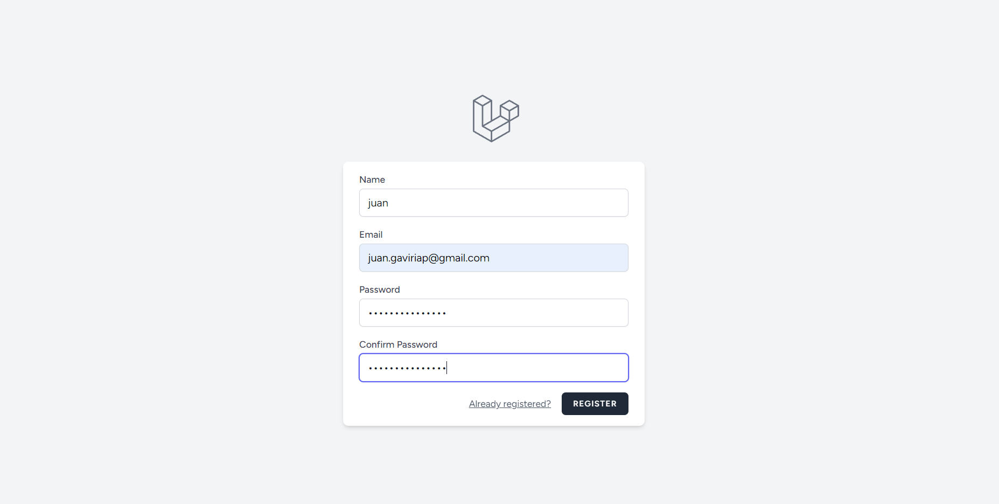

- **Inicio de sesión**

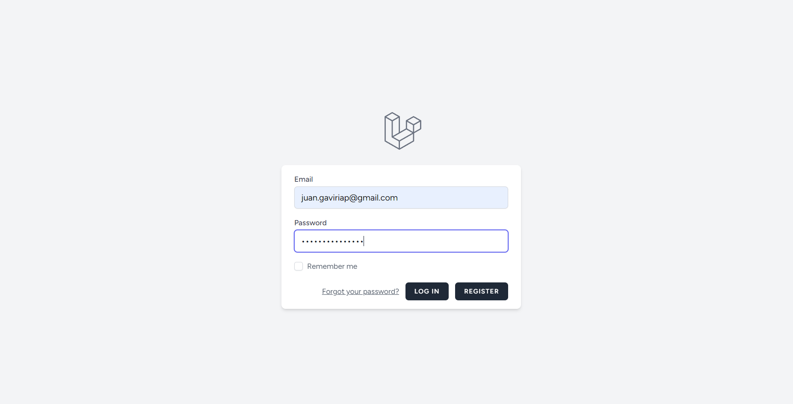

- **Información adicional del perfil de usuario**

- Fecha de cumpleaños.
- Ciudad.

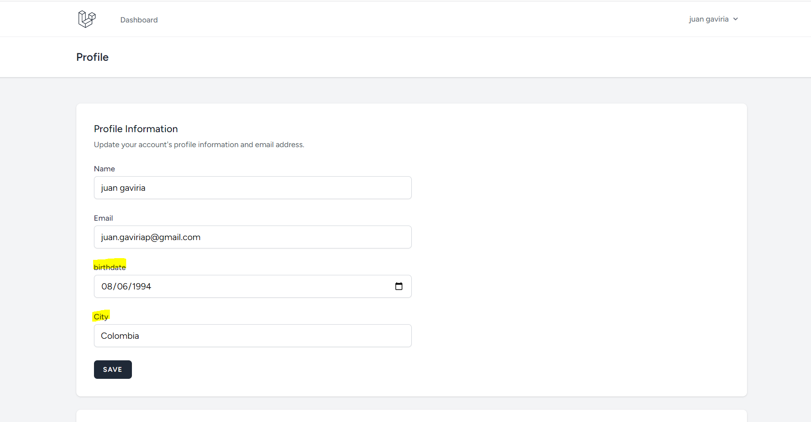

- **Listado de pokemons**

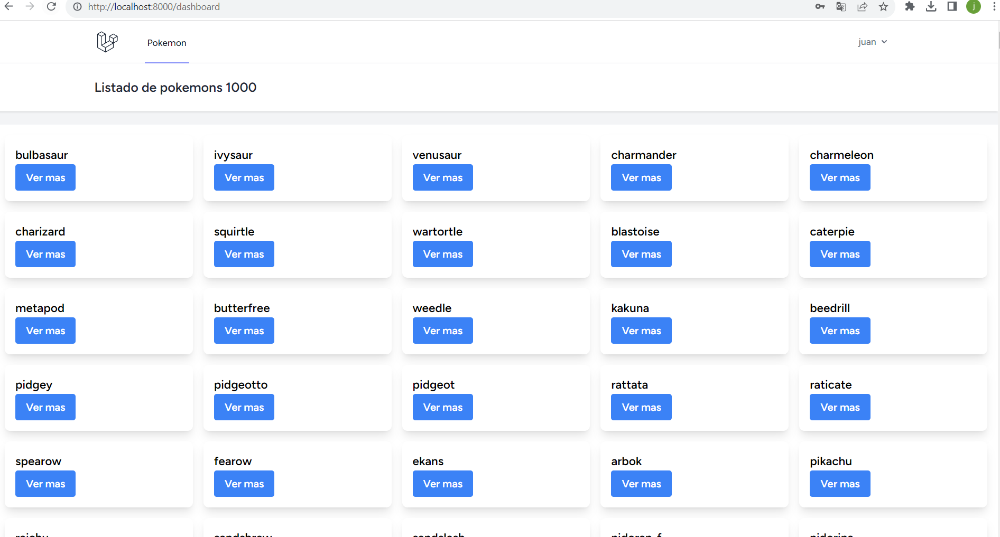

- **Detalle de los pokemons**

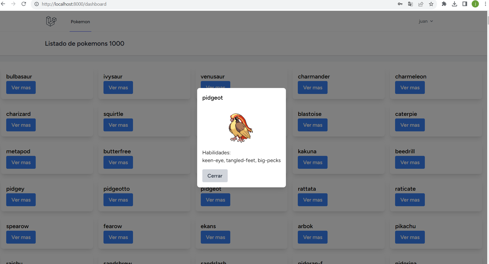

#### Pruebas con phpunit para los modelos de User y Configuration

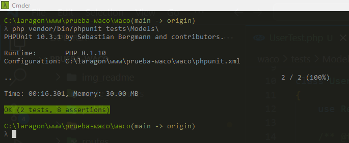

#### 3.Despliegue de la plataforma

Tanto la aplicación como la instancia de base de datos se desplego en el servicio

- https://railway.app/

**Aplicación:**
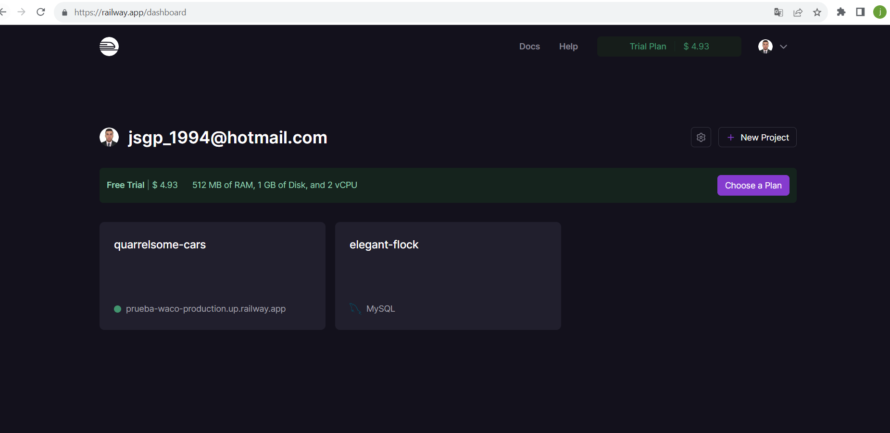
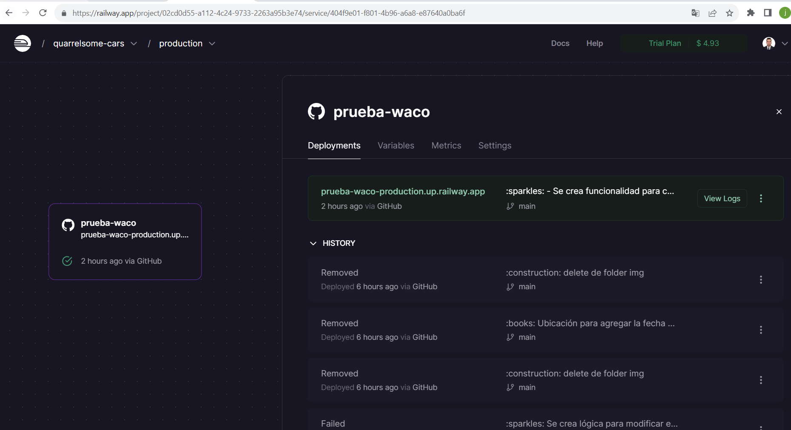
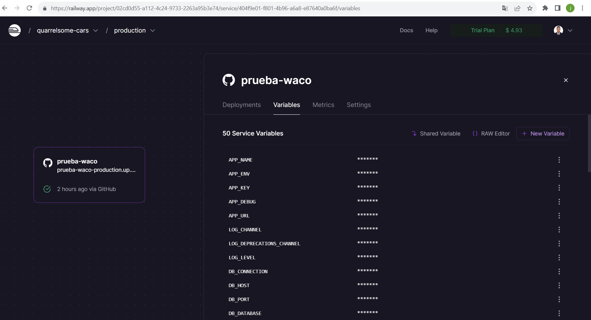

**Base de datos:**
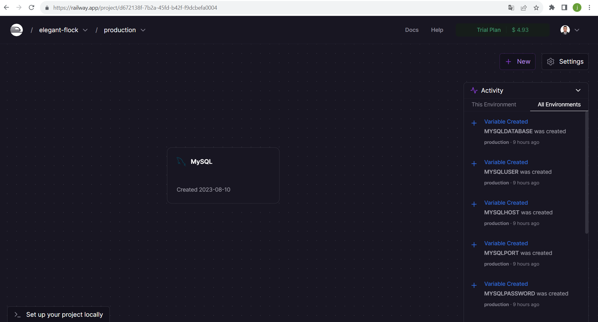
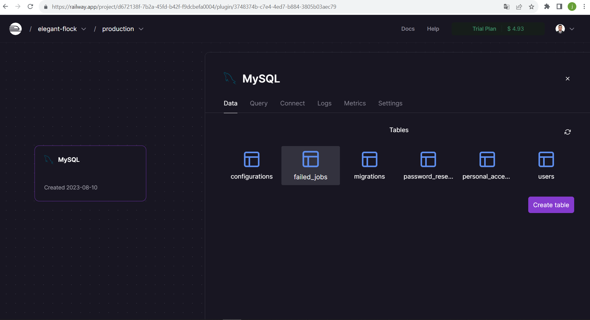